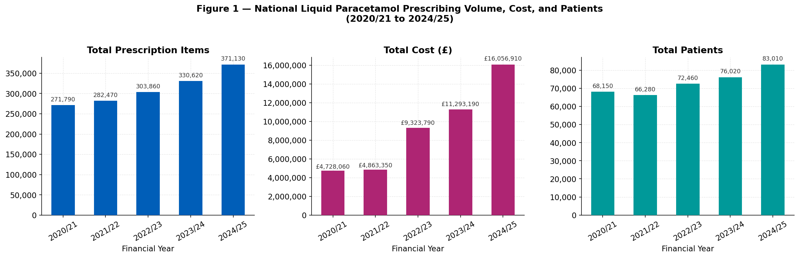
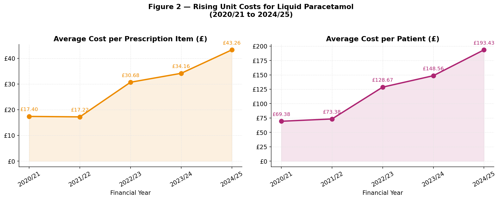
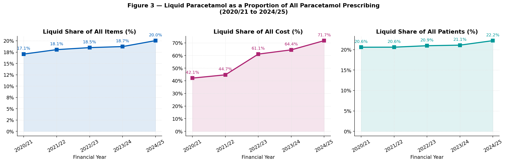
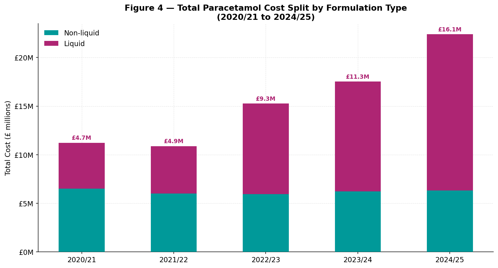
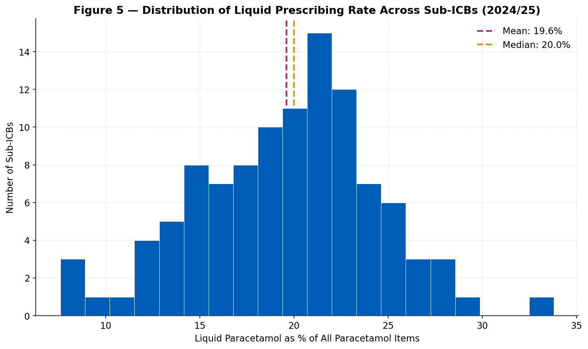
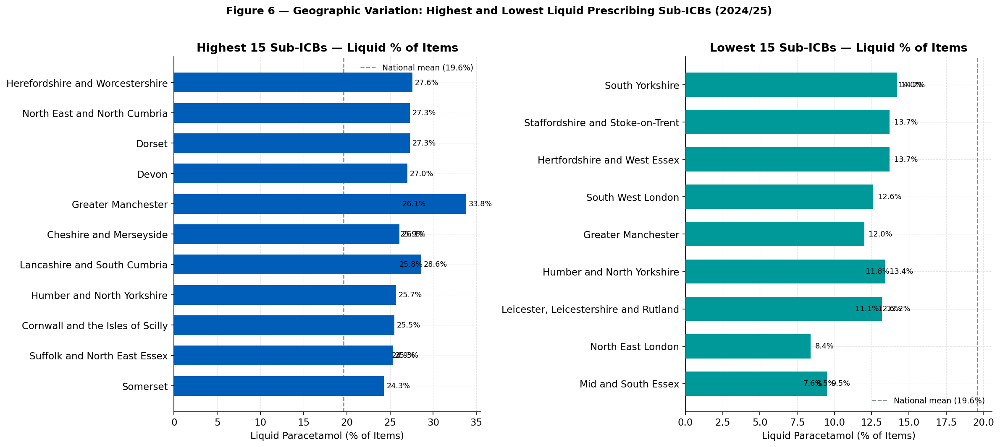
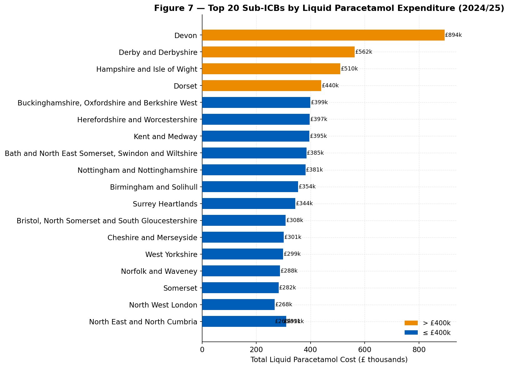
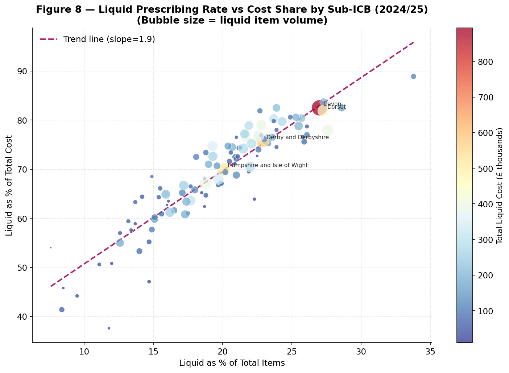
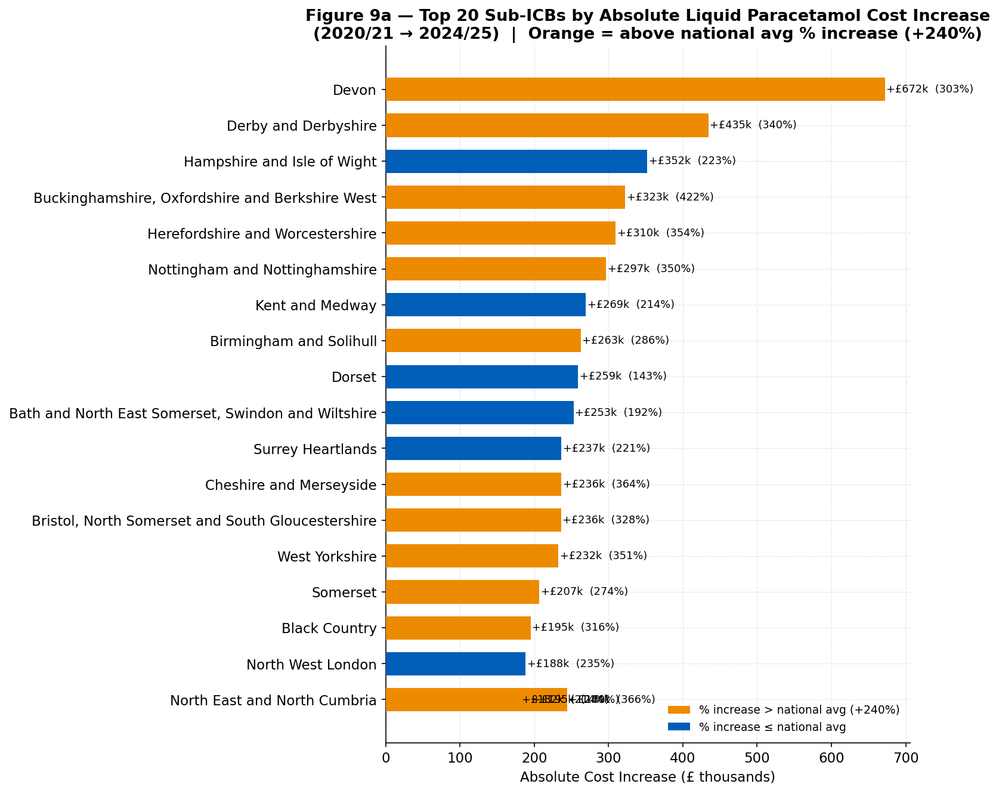
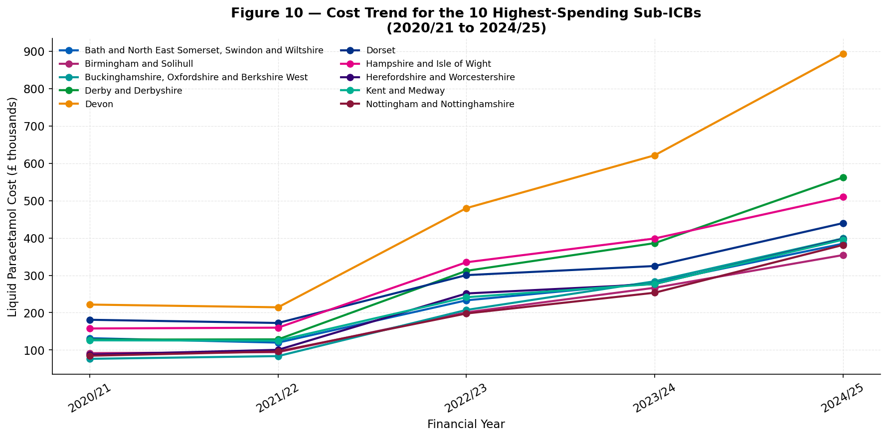

# NHS Sub-ICB Liquid Paracetamol Prescribing Analysis
### An Exploratory Data Analysis of Liquid vs Non-Liquid Paracetamol Prescribing Across England (2020/21 – 2024/25)

---

## Overview

This project analyses NHS prescribing data for paracetamol across 106 Sub-Integrated Care Boards (Sub-ICBs) in England, covering five financial years from 2020/21 to 2024/25. The focus is on **liquid paracetamol** — a formulation that is clinically necessary for patients who cannot safely swallow tablets, including many care home residents and people with dysphagia or advanced dementia.

Liquid paracetamol costs significantly more per dose than tablet equivalents. This analysis explores how prescribing volumes and costs have changed over time nationally, and how patterns vary across Sub-ICBs — with the aim of describing what the data shows rather than making judgements about clinical appropriateness, which would require patient-level data beyond the scope of this dataset.

**Tools used:** Python · pandas · matplotlib · seaborn  
**Data source:** [NHS Business Services Authority (NHSBSA)](https://www.nhsbsa.nhs.uk/)  
**Notebook:** [`Sub_ICB_Paracetamol_Analysis_v2.ipynb`](Sub_ICB_Paracetamol_Analysis_v2.ipynb)

> **To run interactively:** [](https://mybinder.org/v2/gh/YOUR-USERNAME/nhs-paracetamol-prescribing-analysis/HEAD)  
> *(Replace `YOUR-USERNAME` with your GitHub username after uploading)*

---

## Table of Contents

1. [Dataset](#1-dataset)
2. [National Trends — Volume, Cost, and Patients](#2-national-trends--volume-cost-and-patients)
3. [Rising Unit Costs](#3-rising-unit-costs)
4. [Liquid vs Non-Liquid: Share of Items, Cost, and Patients](#4-liquid-vs-non-liquid-share-of-items-cost-and-patients)
5. [Geographic Variation Across Sub-ICBs](#5-geographic-variation-across-sub-icbs)
6. [Relationship Between Prescribing Rate and Cost Share](#6-relationship-between-prescribing-rate-and-cost-share)
7. [Cost Changes Over Time — Top 20 Sub-ICBs](#7-cost-changes-over-time--top-20-sub-icbs)
8. [Trends for the Ten Highest-Cost Sub-ICBs](#8-trends-for-the-ten-highest-cost-sub-icbs)
9. [Summary of Findings](#9-summary-of-findings)
10. [Limitations](#10-limitations)
11. [How to Reproduce](#11-how-to-reproduce)

---

## 1. Dataset

The dataset contains Sub-ICB level NHS prescribing data with the following structure:

| Column | Description |
|---|---|
| `Financial year` | NHS financial year (April–March) |
| `Sub ICB` | Sub-Integrated Care Board — geographic NHS commissioning unit |
| `Paracetamol type` | `Liquid` or `Non-liquid` |
| `Item count` | Number of prescription items |
| `Cost` | Net ingredient cost (£) |
| `Patient count` | Unique patients receiving this formulation |
| `Percentage of items` | Liquid as % of all paracetamol items in that Sub-ICB |
| `Percentage of cost` | Liquid as % of total paracetamol cost in that Sub-ICB |
| `Percentage of patients` | Liquid as % of total paracetamol patients in that Sub-ICB |

- **106** Sub-ICBs · **5** financial years · **no missing values**
- Each Sub-ICB appears twice per year — once for liquid and once for non-liquid

---

## 2. National Trends — Volume, Cost, and Patients



Between 2020/21 and 2024/25, liquid paracetamol prescribing grew across all three measures nationally:

- **Items** increased from ~272,000 to ~371,000 — a rise of **37%**, broadly consistent with care home population growth
- **Patients** receiving liquid paracetamol grew from ~68,000 to ~83,000 (**+22%**)
- **Cost** rose from £4.7 million to £16.1 million — an increase of **240%**, far exceeding the growth in items or patients

The divergence between volume growth (~37%) and cost growth (~240%) is the defining finding of this analysis. It indicates that rising unit prices — not more patients receiving liquid paracetamol — are the dominant driver of increasing expenditure.

---

## 3. Rising Unit Costs



The cost per prescription item for liquid paracetamol rose from **£17.40 in 2020/21** to **£43.26 in 2024/25** — a **149% increase** in five years. The sharpest jump occurred between 2021/22 and 2022/23, when the cost per item nearly doubled from £17.22 to £30.68.

Cost per patient followed the same trajectory, rising from £69 to **£193** — meaning the NHS now spends nearly three times as much per liquid paracetamol patient as it did in 2020/21.

This is consistent with broader NHS supply chain reporting on manufacturer price increases for liquid medicine formulations, which are more complex and costly to produce than solid-dose tablets. These are **national and international supply-side pressures**, not the result of individual prescribing decisions.

---

## 4. Liquid vs Non-Liquid: Share of Items, Cost, and Patients



Liquid paracetamol represents around **17–20% of all prescription items** — a figure that has remained broadly stable across all five years. However, its share of total paracetamol **cost has risen from 42% to over 71%** by 2024/25.

This growing gap between volume share and cost share is almost entirely explained by unit price increases, not by a change in prescribing behaviour. The same population of patients who need liquid paracetamol is now costing the NHS far more because the price of the product has risen substantially.



In 2020/21, liquid and non-liquid paracetamol cost broadly similar amounts nationally (£4.7M vs £6.5M). By 2024/25, liquid costs had reached **£16.1 million** while non-liquid costs remained flat at around £6.3M — confirming that overall growth in paracetamol expenditure is almost entirely attributable to the rising price of liquid formulations.

---

## 5. Geographic Variation Across Sub-ICBs



In 2024/25, the proportion of paracetamol prescriptions that are liquid ranges from **7.6% to 33.8%** across Sub-ICBs — a more than fourfold difference. The distribution is roughly bell-shaped, centred around 20%.

> **Important:** Variation in this metric does not straightforwardly indicate good or poor prescribing practice. A higher rate may reflect more care home beds, higher dysphagia prevalence, or more thorough patient assessment. This data alone cannot determine clinical appropriateness.



**Greater Manchester** has the highest proportion of liquid paracetamol items at **33.8%** — more than four times higher than **Mid and South Essex** at 7.6%. Lancashire and South Cumbria, Herefordshire and Worcestershire, and Dorset also appear consistently in the upper tier.

These areas warrant local contextual investigation — such as cross-referencing with care home capacity and dysphagia referral data — before drawing any conclusions about prescribing behaviour.

---

## 6. Sub-ICBs by Total Liquid Paracetamol Cost (2024/25)



**Devon** has the highest absolute liquid paracetamol spend at ~£894,000 in 2024/25, followed by **Dorset** (£440k) and **Derby and Derbyshire** (£562k). Absolute spend is partly a function of Sub-ICB size — larger areas with more care home patients will naturally spend more in aggregate.

Notably, **Greater Manchester** — which had the highest *proportional* liquid prescribing rate — does not appear at the very top of the absolute cost chart. This illustrates why proportion and absolute spend are different measures that answer different questions: one reflects the clinical mix of prescribing, the other the budget impact.

---

## 7. Relationship Between Prescribing Rate and Cost Share



There is a strong positive correlation between the proportion of paracetamol items that are liquid and the proportion of total paracetamol cost attributable to liquid formulations. The steep trend line confirms that even a modest increase in liquid prescribing rate translates to a disproportionately large increase in cost share — a direct consequence of the price premium of liquid formulations.

This relationship is largely structural: Sub-ICBs with more patients who clinically require liquid paracetamol will, by necessity, sit further along both axes.

---

## 8. Cost Changes Over Time — Top 20 Sub-ICBs

The national average cost increase between 2020/21 and 2024/25 is **+240%** — the baseline driven almost entirely by unit price rises. Sub-ICBs tracking close to this figure have seen price-driven cost increases with broadly stable prescribing. Sub-ICBs significantly above it have seen both price increases *and* genuine growth in liquid prescribing volume or patient numbers.


**Devon (+£672k, +303%)** has the largest absolute cost increase, driven by both price and volume growth (items +37%, patients +26%). **Buckinghamshire, Oxfordshire and Berkshire West (+£323k, +422%)** shows the highest percentage increase in the top 20, with items growing 75% and patients 45% — the strongest volume growth of the group.

**Hampshire (+£352k, +224%)** and **Kent and Medway (+£269k, +214%)** show large absolute increases but sit *below* the national average in percentage terms — their growth is almost entirely price-driven with stable prescribing volumes. **Bath and North East Somerset (+£253k, +192%)** is the clearest example: patient numbers grew just 3%, confirming its increase is almost entirely a price effect.



**Nottinghamshire (+350%)**, **Cheshire and Merseyside (+364%)**, and **North East and North Cumbria - 00P (+366%)** show the steepest proportional growth, driven by item volume increases of 45–88% on top of the universal price rise. These areas have seen genuine expansion in their liquid-prescribing patient population and are the most appropriate candidates for local contextual review.

---

## 9. Trends for the Ten Highest-Cost Sub-ICBs



All ten highest-spending Sub-ICBs show a broadly similar upward cost trajectory, with a visible inflection point around 2021/22–2022/23 when the national cost per item nearly doubled. The parallel nature of these curves confirms that **price is the dominant driver** across all areas — individual trajectories reflect local population growth layered on top of a national price effect.

---

## 9. Summary of Findings

| Finding | Detail |
|---|---|
| **Volume growth is moderate and expected** | Liquid items grew +37%, patients +22% — broadly consistent with care home population trends |
| **Costs grew far faster than volume** | Total cost +240%, driven by unit price increases not prescribing behaviour |
| **Unit price is the primary driver** | Cost per item rose from £17.40 to £43.26 (+149%); sharpest jump in 2021/22–2022/23 |
| **Cost share is disproportionate** | Liquid is ~20% of items but >71% of total paracetamol cost by 2024/25 |
| **Wide geographic variation** | Liquid prescribing rates range from 7.6% (Mid and South Essex) to 33.8% (Greater Manchester) |
| **Devon highest absolute spend** | ~£894k in 2024/25, driven by both volume and price |
| **Greater Manchester highest rate, not highest cost** | Proportion and absolute spend measure different things |
| **Buckinghamshire and Nottinghamshire above-trend growth** | Volume growth well above national average — worth local investigation |

---

## 10. Limitations

- This is **aggregate Sub-ICB level data** — it does not contain individual patient records, diagnoses, or clinical indications
- **Geographic variation cannot be interpreted as inappropriate prescribing** without data on care home capacity, dysphagia prevalence, and patient complexity
- **Unit price increases are a national supply-side issue** and are not driven by individual Sub-ICB prescribing decisions
- The dataset does not include a care home flag — the care home context is assumed from published NHSBSA methodology

---

## 11. How to Reproduce

**Requirements:** Python 3.8+, pandas, matplotlib, seaborn, numpy

```bash
# Clone the repository
git clone https://github.com/YOUR-USERNAME/nhs-paracetamol-prescribing-analysis.git
cd nhs-paracetamol-prescribing-analysis

# Install dependencies
pip install pandas matplotlib seaborn numpy jupyter

# Run the notebook (this also generates all chart images)
jupyter notebook Sub_ICB_Paracetamol_Analysis_v2.ipynb
```

Running all cells will automatically create an `images/` folder and save all figures as `.png` files, which the README uses to display the charts.

---

*Analysis prepared using publicly available NHS prescribing data. Data licence: please refer to [NHSBSA Open Data](https://www.nhsbsa.nhs.uk/access-our-data-products) for terms of reuse.*
